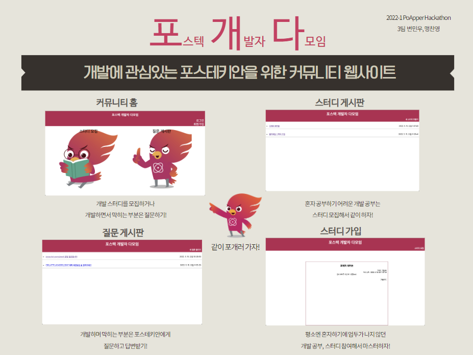
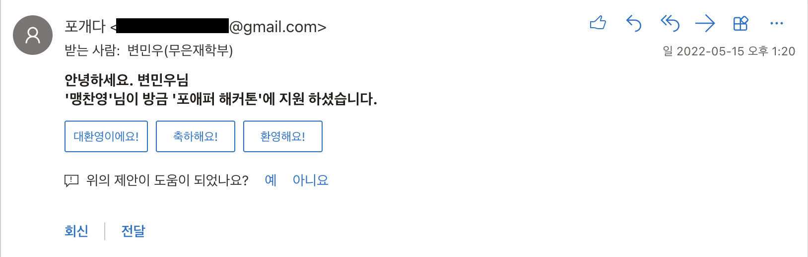
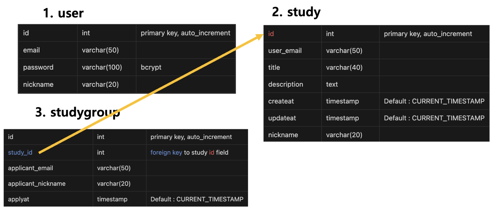
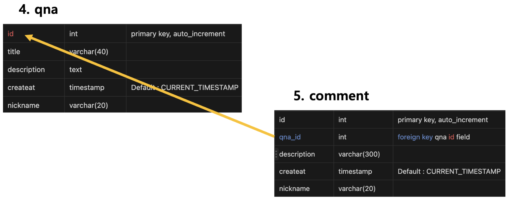

# Postech Developer Community
### 5/14 ~ 5/15, 24시간 동안 진행한 포스텍 포애퍼 동아리 해커톤 결과물입니다.
 

## **Overview**
* * *

 
 

## Stack & Team members
* * *
#### - **Front end**(맹찬영) : HTML, CSS, Javascript, EJS
#### - **Back end**(변민우) : Nodejs, Express, Typescript, MySQL

 
 

## __Features__
* * *
- 회원가입 & 로그인
- 회원가입시 포스텍 이메일만 가능
- 비밀번호 더블 체크
 

### 1. 스터디 게시판
- 로그인 시 스터디 모집 글 작성 가능
- 로그인 시 스터디 지원 가능
- 스터디 모집 글을 작성한 사용자만 스터디 지원자 확인 가능
- 스터디 지원 시 스터디 모집 글을 쓴 사용자에게 자동으로 이메일 전송
 
    
 

### 2. 질문 게시판
- 로그인 시 질문 글 작성 가능
- 로그인 시 댓글 작성 가능

 
 

## **Database**
* * *

 

 

 

